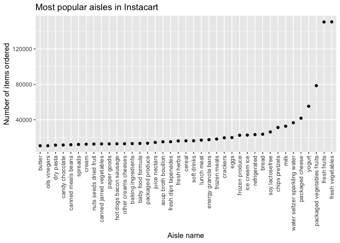

p8105\_hw3\_ll3344
================
Lusha Liang

## Problem 1

Load the instacart dataset from the p8105 datasets and load necessary
packages.

``` r
library(p8105.datasets)
data("instacart")

library(tidyverse)
```

    ## ── Attaching packages ─────────────────────────────────────────────────────────────────────────── tidyverse 1.3.0 ──

    ## ✓ ggplot2 3.3.2     ✓ purrr   0.3.4
    ## ✓ tibble  3.0.1     ✓ dplyr   1.0.2
    ## ✓ tidyr   1.1.0     ✓ stringr 1.4.0
    ## ✓ readr   1.3.1     ✓ forcats 0.5.0

    ## ── Conflicts ────────────────────────────────────────────────────────────────────────────── tidyverse_conflicts() ──
    ## x dplyr::filter() masks stats::filter()
    ## x dplyr::lag()    masks stats::lag()

  - The instacart dataset essentially shows online grocery store
    purchases from different users (user\_id) and shows the particular
    item purchased (product\_name) as well as the time of day the item
    was purchased (order\_hour\_of\_day), the day of the week
    (order\_dow), and the aisle to which the product belongs (aisle).
    The dataset also contains information on whether or not the product
    was a re-order (reordered), among other information.
  - The dataset contains 1384617 observations. Each row in the dataset
    is a product from an order. There is a single order per user in this
    dataset.
  - There are 15 variables. Variables included are: order\_id,
    product\_id, add\_to\_cart\_order, reordered, user\_id, eval\_set,
    order\_number, order\_dow, order\_hour\_of\_day,
    days\_since\_prior\_order, product\_name, aisle\_id, department\_id,
    aisle, department.
  - To give an example, row 1 shows a purchase by a customer with User
    ID \# 112108 who is reordering Bulgarian Yogurt at 10 AM.

Now let’s figure out how many aisles are represented in the dataset:

``` r
instacart %>%
  count(aisle) %>%
  arrange(desc(n))
```

    ## # A tibble: 134 x 2
    ##    aisle                              n
    ##    <chr>                          <int>
    ##  1 fresh vegetables              150609
    ##  2 fresh fruits                  150473
    ##  3 packaged vegetables fruits     78493
    ##  4 yogurt                         55240
    ##  5 packaged cheese                41699
    ##  6 water seltzer sparkling water  36617
    ##  7 milk                           32644
    ##  8 chips pretzels                 31269
    ##  9 soy lactosefree                26240
    ## 10 bread                          23635
    ## # … with 124 more rows

There are 134 aisles. The top 5 most ordered from aisles are fresh
vegetables, fresh fruits, packaged vegetables/fruits, yogurt, and
packaged cheese.

Now let’s make a plot that shows the number of items ordered in each
aisle, limiting to aisles with more than 10,000 items ordered.

``` r
instacart %>%
  count(aisle) %>%
  filter(n > 10000) %>%
  mutate(
    aisle = factor(aisle),
    aisle = fct_reorder(aisle, n)
  ) %>%
  ggplot(aes(x = aisle, y = n)) + 
  geom_point() +
  theme(axis.text.x = element_text(angle = 90, vjust = 0.5, hjust=1)) +
  xlab("Aisle name") + 
  ylab("Number of items ordered") +
  ggtitle("Most popular aisles in Instacart")
```

<!-- --> The
aisles are ordered on the X-axis from left to right by increasing number
of items ordered.

We will now make a table featuring the three most popular items in the
aisles: “baking ingredients”, “dog food care”, and “packaged vegetables
fruits.”

``` r
instacart %>%
  filter(aisle %in% c("baking ingredients", "dog food care", "packaged vegetables fruits")) %>% 
  group_by(aisle) %>%
  count(product_name) %>%
  mutate(rank = min_rank(desc(n))) %>%
  filter(rank < 4) %>%
  arrange(aisle, rank) %>%
  knitr::kable()
```

| aisle                      | product\_name                                 |    n | rank |
| :------------------------- | :-------------------------------------------- | ---: | ---: |
| baking ingredients         | Light Brown Sugar                             |  499 |    1 |
| baking ingredients         | Pure Baking Soda                              |  387 |    2 |
| baking ingredients         | Cane Sugar                                    |  336 |    3 |
| dog food care              | Snack Sticks Chicken & Rice Recipe Dog Treats |   30 |    1 |
| dog food care              | Organix Chicken & Brown Rice Recipe           |   28 |    2 |
| dog food care              | Small Dog Biscuits                            |   26 |    3 |
| packaged vegetables fruits | Organic Baby Spinach                          | 9784 |    1 |
| packaged vegetables fruits | Organic Raspberries                           | 5546 |    2 |
| packaged vegetables fruits | Organic Blueberries                           | 4966 |    3 |

Finally, we will make a table showing the mean hour of the day at which
Pink Lady Apples and Coffee Ice Cream are ordered on each day of the
week.

``` r
instacart %>% 
  filter(product_name %in% c("Pink Lady Apples", "Coffee Ice Cream")) %>%
  group_by(product_name, order_dow) %>%
  summarize(mean_hour = mean(order_hour_of_day)) %>%
  pivot_wider(
    names_from = order_dow,
    values_from = mean_hour
  ) %>%
  knitr::kable()
```

    ## `summarise()` regrouping output by 'product_name' (override with `.groups` argument)

| product\_name    |        0 |        1 |        2 |        3 |        4 |        5 |        6 |
| :--------------- | -------: | -------: | -------: | -------: | -------: | -------: | -------: |
| Coffee Ice Cream | 13.77419 | 14.31579 | 15.38095 | 15.31818 | 15.21739 | 12.26316 | 13.83333 |
| Pink Lady Apples | 13.44118 | 11.36000 | 11.70213 | 14.25000 | 11.55172 | 12.78431 | 11.93750 |

## Problem 2

Load accelerometer data.

``` r
accel_df = 
  read_csv("./data/accel_data.csv") 
```

    ## Parsed with column specification:
    ## cols(
    ##   .default = col_double(),
    ##   day = col_character()
    ## )

    ## See spec(...) for full column specifications.

Clean and wrangle the data. Your final dataset should include all
originally observed variables and values; have useful variable names;
and encode data with reasonable variable classes. Describe the resulting
dataset (e.g. what variables exist, how many observations, etc).

``` r
accel_df = 
  accel_df %>%
  janitor::clean_names() %>%
  mutate(weekend = ifelse(day %in% c("Saturday", "Sunday"), "weekend", "weekday")) %>%
  relocate(week, day_id, day, weekend) %>%
  pivot_longer(
    activity_1:activity_1440,
    names_to = "minute_of_day",
    names_prefix = "activity_",
    values_to = "activity"
  ) %>%
  mutate(day = as.factor(day),
         weekend = as.factor(weekend),
         minute_of_day = as.numeric(minute_of_day),
         )
```

There are a total of 50400 rows and 6 columns.
