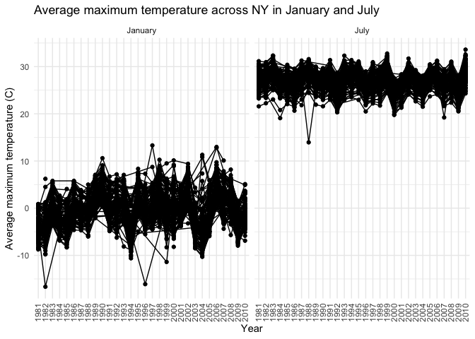
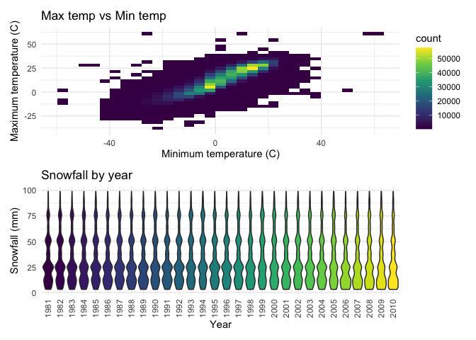

p8105\_hw3\_ll3344
================
Lusha Liang

First, load all necessary
    libraries:

``` r
library(tidyverse)
```

    ## ── Attaching packages ──────────────────────────────────────────────────────────────────────────────────────────────────────────────────── tidyverse 1.3.0 ──

    ## ✓ ggplot2 3.3.2     ✓ purrr   0.3.4
    ## ✓ tibble  3.0.1     ✓ dplyr   1.0.2
    ## ✓ tidyr   1.1.0     ✓ stringr 1.4.0
    ## ✓ readr   1.3.1     ✓ forcats 0.5.0

    ## ── Conflicts ─────────────────────────────────────────────────────────────────────────────────────────────────────────────────────── tidyverse_conflicts() ──
    ## x dplyr::filter() masks stats::filter()
    ## x dplyr::lag()    masks stats::lag()

``` r
library(p8105.datasets)
library(patchwork)
```

And set some ggplot preferences:

``` r
# Minimalist theme
theme_set(theme_minimal())

# Viridis color scheme for best visualization and color separation
options(
  ggplot2.continuous.color = "viridis",
  ggplot2.continuous.fill = "viridis"
)

scale_color_discrete = scale_color_viridis_d
scale_fill_discrete = scale_fill_viridis_d
```

## Problem 1

Load the instacart dataset from the p8105 datasets.

``` r
data("instacart")
```

  - The instacart dataset essentially shows online grocery store
    purchases from different users (user\_id) and shows the particular
    item purchased (product\_name) as well as the time of day the item
    was purchased (order\_hour\_of\_day), the day of the week
    (order\_dow), and the aisle to which the product belongs (aisle).
    The dataset also contains information on whether or not the product
    was a re-order (reordered), among other information.
  - The dataset contains 1384617 observations. Each row in the dataset
    is a product from an order. There is a single order per user in this
    dataset.
  - There are 15 variables. Variables included are: order\_id,
    product\_id, add\_to\_cart\_order, reordered, user\_id, eval\_set,
    order\_number, order\_dow, order\_hour\_of\_day,
    days\_since\_prior\_order, product\_name, aisle\_id, department\_id,
    aisle, department.
  - To give an example, row 1 shows a purchase by a customer with User
    ID \# 112108 who is reordering Bulgarian Yogurt at 10 AM.

Now let’s figure out how many aisles are represented in the dataset:

``` r
instacart %>%
  count(aisle) %>%
  arrange(desc(n))
```

    ## # A tibble: 134 x 2
    ##    aisle                              n
    ##    <chr>                          <int>
    ##  1 fresh vegetables              150609
    ##  2 fresh fruits                  150473
    ##  3 packaged vegetables fruits     78493
    ##  4 yogurt                         55240
    ##  5 packaged cheese                41699
    ##  6 water seltzer sparkling water  36617
    ##  7 milk                           32644
    ##  8 chips pretzels                 31269
    ##  9 soy lactosefree                26240
    ## 10 bread                          23635
    ## # … with 124 more rows

There are 134 aisles. The top 5 most ordered from aisles are fresh
vegetables, fresh fruits, packaged vegetables/fruits, yogurt, and
packaged cheese.

Now let’s make a plot that shows the number of items ordered in each
aisle, limiting to aisles with more than 10,000 items ordered.

``` r
instacart %>%
  count(aisle) %>%
  filter(n > 10000) %>%
  mutate(
    aisle = factor(aisle),
    aisle = fct_reorder(aisle, n)
  ) %>%
  ggplot(aes(x = aisle, y = n)) + 
  geom_point() +
  theme(axis.text.x = element_text(angle = 90, vjust = 0.5, hjust=1)) +
  xlab("Aisle name") + 
  ylab("Number of items ordered") +
  ggtitle("Most popular aisles in Instacart")
```

<!-- -->

The aisles are ordered on the X-axis from left to right by increasing
number of items ordered.

We will now make a table featuring the three most popular items in the
aisles: “baking ingredients”, “dog food care”, and “packaged vegetables
fruits.”

``` r
instacart %>%
  filter(aisle %in% c("baking ingredients", "dog food care", "packaged vegetables fruits")) %>% 
  group_by(aisle) %>%
  count(product_name) %>%
  mutate(rank = min_rank(desc(n))) %>%
  filter(rank < 4) %>%
  arrange(aisle, rank) %>%
  knitr::kable()
```

| aisle                      | product\_name                                 |    n | rank |
| :------------------------- | :-------------------------------------------- | ---: | ---: |
| baking ingredients         | Light Brown Sugar                             |  499 |    1 |
| baking ingredients         | Pure Baking Soda                              |  387 |    2 |
| baking ingredients         | Cane Sugar                                    |  336 |    3 |
| dog food care              | Snack Sticks Chicken & Rice Recipe Dog Treats |   30 |    1 |
| dog food care              | Organix Chicken & Brown Rice Recipe           |   28 |    2 |
| dog food care              | Small Dog Biscuits                            |   26 |    3 |
| packaged vegetables fruits | Organic Baby Spinach                          | 9784 |    1 |
| packaged vegetables fruits | Organic Raspberries                           | 5546 |    2 |
| packaged vegetables fruits | Organic Blueberries                           | 4966 |    3 |

Finally, we will make a table showing the mean hour of the day at which
Pink Lady Apples and Coffee Ice Cream are ordered on each day of the
week.

``` r
instacart %>% 
  filter(product_name %in% c("Pink Lady Apples", "Coffee Ice Cream")) %>%
  group_by(product_name, order_dow) %>%
  summarize(mean_hour = mean(order_hour_of_day)) %>%
  pivot_wider(
    names_from = order_dow,
    values_from = mean_hour
  ) %>%
  knitr::kable()
```

    ## `summarise()` regrouping output by 'product_name' (override with `.groups` argument)

| product\_name    |        0 |        1 |        2 |        3 |        4 |        5 |        6 |
| :--------------- | -------: | -------: | -------: | -------: | -------: | -------: | -------: |
| Coffee Ice Cream | 13.77419 | 14.31579 | 15.38095 | 15.31818 | 15.21739 | 12.26316 | 13.83333 |
| Pink Lady Apples | 13.44118 | 11.36000 | 11.70213 | 14.25000 | 11.55172 | 12.78431 | 11.93750 |

## Problem 2

Load accelerometer data.

``` r
accel_df = 
  read_csv("./data/accel_data.csv") 
```

    ## Parsed with column specification:
    ## cols(
    ##   .default = col_double(),
    ##   day = col_character()
    ## )

    ## See spec(...) for full column specifications.

Clean and wrangle the data. The data presented are not tidy in that the
activity variables contain information both about the minute of time at
which the activity occurred as well as the amount of activity. Thus we
will need to utilize pivot\_longer. In addition, the data are ordered by
week but the days of the week appear to be ordered alphabetically rather
than chronologically so this will need to be reordered.

``` r
accel_df = 
  accel_df %>%
  janitor::clean_names() %>%
  mutate(weekend = ifelse(day %in% c("Saturday", "Sunday"), "weekend", "weekday")) %>%
  relocate(week, day_id, day, weekend) %>%
  pivot_longer(
    activity_1:activity_1440,
    names_to = "minute_of_day",
    names_prefix = "activity_",
    values_to = "activity"
  ) %>%
  mutate(day = factor(day, levels = c("Monday", "Tuesday", "Wednesday", "Thursday", "Friday", "Saturday", "Sunday")),
         weekend = factor(weekend),
         minute_of_day = as.numeric(minute_of_day),
         ) %>%
  group_by(week) %>%
  arrange(day, .by_group = TRUE)
```

  - There are a total of 50400 observations and 6 variables.
  - The 6 variables are: week, day\_id, day, weekend, minute\_of\_day,
    activity.
  - The majority of the data correspond to activity information for each
    minute of the day spanning the course of 35 days (5 weeks).

We will now sum total minutes of activity for each day and create a
table showing these totals. We will use pivot\_wider to make the data
more readable.

``` r
accel_df %>%
  group_by(day, week) %>%
  summarize(total_activity = sum(activity)) %>%
  pivot_wider(
    names_from = week,
    values_from = total_activity
  ) %>%
  knitr::kable()
```

    ## `summarise()` regrouping output by 'day' (override with `.groups` argument)

| day       |         1 |      2 |      3 |      4 |      5 |
| :-------- | --------: | -----: | -----: | -----: | -----: |
| Monday    |  78828.07 | 295431 | 685910 | 409450 | 389080 |
| Tuesday   | 307094.24 | 423245 | 381507 | 319568 | 367824 |
| Wednesday | 340115.01 | 440962 | 468869 | 434460 | 445366 |
| Thursday  | 355923.64 | 474048 | 371230 | 340291 | 549658 |
| Friday    | 480542.62 | 568839 | 467420 | 154049 | 620860 |
| Saturday  | 376254.00 | 607175 | 382928 |   1440 |   1440 |
| Sunday    | 631105.00 | 422018 | 467052 | 260617 | 138421 |

It seems that on average the patient has less activity on Saturdays and
more on Fridays. There does not seem to be a significant trend moving
from week to week.

We will now plot the patient’s activity over the course of the day.

``` r
accel_df %>%
  ggplot(aes(x = minute_of_day,
             y = activity,
             color = day)) +
  geom_line(alpha =.5) +
  geom_smooth() +
  xlab("Minute of the day") + 
  ylab("Activity") +
  ggtitle("Activity throughout the week") + 
  scale_color_discrete("Day of the week")
```

    ## `geom_smooth()` using method = 'gam' and formula 'y ~ s(x, bs = "cs")'

<!-- -->

The patient has little activity between minutes 0 to about 400. This
corresponds to the hours between midnight and approximately 7am, during
which time he is probably sleeping. His most active periods during the
week appear to be Sunday mornings and Friday evenings.

## Problem 3

Load the noaa dataset.

``` r
data("ny_noaa")
```

  - This dataset contains information from the NOAA (National Oceanic
    and Atmospheric Association) National Climatic Data Center for all
    New York state weather stations from January 1, 1981 through
    December 31, 2010.
  - It contains 2595176 observations of 7 variables.
  - Essentially for each day from January 1, 1981-December 31, 2010 the
    dataset contains information on the amount of precipitation in
    tenths of mm (prcp), snowfall in mm (snow), snow depth in mm (snwd),
    as well as the maximum (tmax) and minimum temperature (tmin) in
    Celsius.
  - Since each station only collects a subset of this data, the
    resulting dataset does contain a significant amount of missing data
    shown in the below table by column/variable.

<!-- end list -->

``` r
ny_noaa %>%
  summarise_all(funs(sum(is.na(.))))
```

    ## Warning: `funs()` is deprecated as of dplyr 0.8.0.
    ## Please use a list of either functions or lambdas: 
    ## 
    ##   # Simple named list: 
    ##   list(mean = mean, median = median)
    ## 
    ##   # Auto named with `tibble::lst()`: 
    ##   tibble::lst(mean, median)
    ## 
    ##   # Using lambdas
    ##   list(~ mean(., trim = .2), ~ median(., na.rm = TRUE))
    ## This warning is displayed once every 8 hours.
    ## Call `lifecycle::last_warnings()` to see where this warning was generated.

    ## # A tibble: 1 x 7
    ##      id  date   prcp   snow   snwd    tmax    tmin
    ##   <int> <int>  <int>  <int>  <int>   <int>   <int>
    ## 1     0     0 145838 381221 591786 1134358 1134420

Now we will clean the data. We will use the separate function to split
up the month, date, and year currently all contained in the “date”
variable. We will also change the units of tmax and tmin so that they
are easier to understand and ensure variables are coded correctly for
later analysis.

``` r
noaa_df = 
  ny_noaa %>% 
  separate(date, into = c("year", "month", "day"), sep = "-") %>%
  mutate(tmax = as.numeric(tmax)/10,
         tmin = as.numeric(tmin)/10,
         year = as.factor(year),
         month = as.integer(month),
         day = as.integer(day)
         ) 

# Create a table to assign corresponding month names to the month numbers. 
month_df = 
  tibble(
    month = 1:12,
    month_name = month.name
  )

# Add month names 
noaa_df = 
  left_join(noaa_df, month_df, by = "month")
```

The units for precipitation and snowfall/snow depth have remained the
same but we have converted the temperatures into Celsius rather than
tenths of degrees Celsius.

``` r
noaa_df %>%
  count(snow) %>%
  arrange(desc(n)) %>%
  head()
```

    ## # A tibble: 6 x 2
    ##    snow       n
    ##   <int>   <int>
    ## 1     0 2008508
    ## 2    NA  381221
    ## 3    25   31022
    ## 4    13   23095
    ## 5    51   18274
    ## 6    76   10173

The top 5 most commonly observed values for snowfall are 0 mm, NA, 25
mm, 13 mm, and 51 mm. The numbers may seem somewhat arbitrary but make
more sense when we consider that snowfall was likely measured in inches,
then converted into mm. 13mm ~ 0.5 inch, 25 mm ~ 1 inch, 51 mm ~ 2
inches, and so on.

We will now make a two-panel plot showing the average max temperature in
each station across years.

``` r
noaa_df %>%
  filter(month_name == "January" | month_name == "July") %>%
  drop_na() %>%
  group_by(id, year, month_name) %>%
  summarize(mean_max = mean(tmax)) %>%
  ggplot(aes(x = year, y = mean_max, group = id)) +
  geom_point() +
  geom_path() +
  facet_grid(~month_name) +
  theme(axis.text.x = element_text(angle = 90, vjust = 0.5, hjust=1)) +
  xlab("Year") + 
  ylab("Average maximum temperature (C)") +
  ggtitle("Average maximum temperature across NY in January and July")
```

    ## `summarise()` regrouping output by 'id', 'year' (override with `.groups` argument)

<!-- -->

The plot shows that as expected the maximum temperature in July is about
30 degrees Celsius higher than in January in NY. There is no clear trend
over time although certain stations appear to be more consistently
warmer in January and July than other stations, reflecting temperature
variations across NY state. There are two notable outliers in January
1982 and 1996 with markedly lower temperatures. There is also an outlier
in July 1988 which also appeared to have a markedly lower temperature
than would be expected. In addition there does appear to be a somewhat
cyclical nature to maximum temperatures in that for example in 1988
temperatures seemed a bit cooler overall but then seem to rise in
1990,then drop again in 1994.

Finally, we will make a two-panel plot showing (i) tmax vs tmin for the
full dataset; and (ii) make a plot showing the distribution of snowfall
values greater than 0 and less than 100 separately by year. We will use
the patchwork package to link the two graphs.

``` r
tmax_tmin_p = 
  noaa_df %>%
  ggplot(aes(x = tmin, y = tmax)) +
  geom_bin2d() +
  xlab("Minimum temperature (C)") +
  ylab("Maximum temperature (C)") +
  theme(legend.position = "right") +
  ggtitle("Max temp vs Min temp")

snowfall_p = 
  noaa_df %>%
  filter(snow > 0, snow < 100) %>%
  ggplot(aes(x = year, y = snow)) +
  geom_violin(aes(fill = year)) + 
  xlab("Year") + 
  ylab("Snowfall (mm)") +
  theme(axis.text.x = element_text(angle = 90, vjust = 0.5, hjust=1), legend.position = "none") + 
  ggtitle("Snowfall by year")

tmax_tmin_p/snowfall_p
```

    ## Warning: Removed 1136276 rows containing non-finite values (stat_bin2d).

<!-- -->
